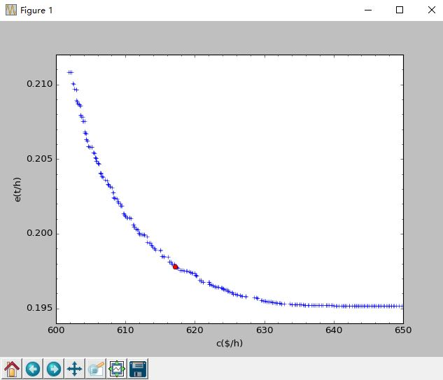
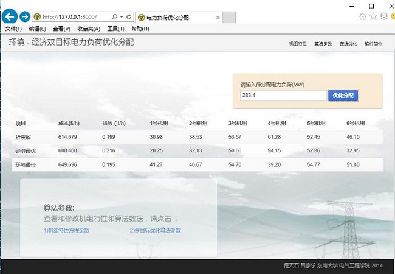

# Environmental/Economic Electric Power Dispatch by NSGA-II 

## 1 Algorithm shared Library 

* Develpoment Environment: Windows 64, Visual Studio 2015: [Visual Studio 2015 Project](./EED_VC)

### 1.1 NSGA-II shared Library 

* This shared  Library is based on the NSGA-II (Non-dominated Sorting Genetic Algorithm) riginal code in C from:

  Dr. Kalyanmoy Deb: http://www.iitk.ac.in/kangal/

### 1.2 Environmental-Economic Electric Power Dispatchshared  Library 

* This shared Library is based our NSGA-II shared  Library for developing the applications 

  around Environmental-Economic Electric Power Dispatch

## 2 Example with Python 

* Python 3.5

* Python packages： Numpy  Matplotlib Tornado

* The standard IEEE six-generator 30-bus test system

  * M.A. Abido. A novel multiobjective evolutionary algorithm for environmental/economic power dispatch, Electric Power Systems Research. (65):71-81 , 2003,）
 
  is used to demonstrate the effectiveness of our shared Library

### 2.1 Example of API with Python: [PythonExample](./PythonExample)

* Run

```bash
>python biobjloaddispatch.py
```

```Python
from ctypes import *
import numpy as np
import pylab as plt

class nsga2cfg(Structure):
    _fields_ = [("nreal",c_int),
                ("nobj",c_int),
                ("ncon",c_int),
                ("popsize",c_int),
                ("ngen",c_int),
                ("pcross_real",c_double),
                ("pmut_real",c_double),
                ("eta_c",c_double),
                ("eta_m",c_double)]
          
class curvecoff(Structure):
    _fields_ = [("c",c_float*3),
                ("e",c_float*5)]

class unitload(Structure):
    _fields_ = [("min",c_float),
                ("max",c_float),
                ("coff",curvecoff)]

class loadv(Structure):
    _fields_ = [("xreal",c_float*10),
                ("cobj",c_float),
                ("eobj",c_float)]

load_min =[0.05,0.05,0.05,0.05,0.05,0.05]
load_max = (c_double*6)()
load_max =[1.5,1.5,1.15,1.5,1.5,1.5]

c=[[10,200,100],
   [10,150,120],
   [20,180,40],
   [10,100,60],
   [20,180,40],
   [10,150,100]]

e = (c_double*6*5)()
e=[[4.091,-5.554,6.490,2.0e-4,2.857],
   [2.543,-6.047,5.638,5.0e-4,3.333],
   [4.258,-5.094,4.586,1.0e-6,8.000],
   [5.426,-3.550,3.380,2.0e-3,2.000],
   [4.258,-5.094,4.586,1.0e-6,8.000],
   [6.131,-5.555,5.151,1.0e-5,6.667]]

mydll=windll.libseu_biobjloaddispatch
f=mydll.seu_biobjloaddispatch

unitnum=c_int()
totalload=c_double()
ga=nsga2cfg()
popsize=c_int()
bestC=loadv()
bestE=loadv()
best=loadv()  

unitnum=6

uload=(unitload*unitnum)()
for i in range(unitnum):
   uload[i].min = load_min[i]
   uload[i].max = load_max[i]
   for j in range(3):
     uload[i].coff.c[j]=c[i][j]
   for j in range(5):
     uload[i].coff.e[j]=e[i][j] 

ga.nreal=unitnum
ga.nobj=2
ga.ncon=1
ga.popsize=200
ga.ngen=200
ga.pcross_real=0.9
ga.pmut_real=0.1
ga.eta_c=20
ga.eta_m=15

x = (POINTER(c_double) * ga.popsize)()
for i in range(ga.popsize):
    x[i] = (c_double * ga.nreal)()
    
obj = (POINTER(c_double) * ga.popsize)()
for i in range(ga.popsize):
    obj[i] = (c_double *ga.nobj)()

totalload=2.834

f(ga,unitnum,uload,c_double(totalload),byref(x),byref(obj),byref(popsize),byref(bestC),byref(bestE),byref(best))

print('--bestC--')
print(bestC.cobj)
print(bestC.eobj)
print('--load--')
for i in range(ga.nreal):
    print(bestC.xreal[i]*100)

print('--bestE--')
print(bestE.cobj)
print(bestE.eobj)
print('--load--')
for i in range(ga.nreal):
    print(bestE.xreal[i]*100)
    
print('--best--')
print(best.cobj)
print(best.eobj)
print('--load--')
for i in range(ga.nreal):
    print(best.xreal[i]*100)

# print('--pareto--cobj')
c=np.zeros(shape=(ga.popsize))
for i in range(ga.popsize):
   c[i]=obj[i][0]
#  print(obj[i][0])
   
# print('--pareto--eobj')   
e=np.zeros(shape=(ga.popsize))
for i in range(ga.popsize):
   e[i]=obj[i][1]
#   print(obj[i][1])

bc=np.zeros(shape=(1))
bc[0]=best.cobj
be=np.zeros(shape=(1))
be[0]=best.eobj
   
plt.plot(c,e,'b+',label='Pareto')
plt.plot(bc,be,'ro',label='Best')
plt.minorticks_on()
plt.xlabel('c($/h)')
plt.ylabel('e(t/h)')
plt.show()

```


### 2.2  Example of Web application: WebAppExample](./WebAppExample)

The simple Web application is based Tornado

* Run

```bash
>python app.py
```



## 3 PPT [Chinese](./doc)

* This PPT is designed for introduce our shared  library and it's application 

  at Chinese Undergraduate Computer Design Contest 2014

## 4 Award:

* 1st Prize of 7th China Undergraduate Computer Design Contest in Jiangsu Province   

* 3rd Prize of 7th China Undergraduate Computer Design Contest   
  
## 5 License

MIT

 
